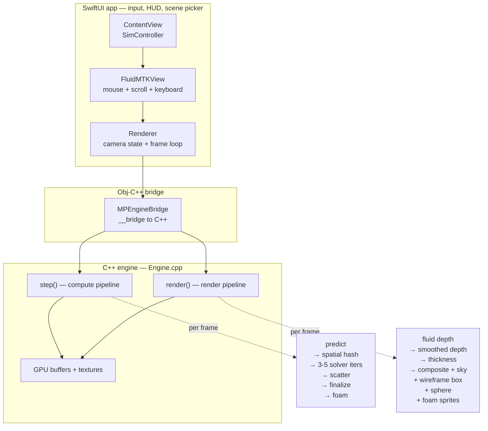

<div align="center">

# mtlphys

**Real-time 3D fluid simulation on Apple Silicon.**
Position-Based Fluids solver + screen-space rendering, built directly on Metal.

<!-- Replace with actual hero render once captured -->


[Demo video](#demo) · [Performance](#performance) · [Architecture](#architecture) · [Build](#build--run)

</div>

---

## What it is

A from-scratch GPU fluid engine for Apple Silicon. The simulation is **Position-Based Fluids** (Macklin & Müller 2013) running entirely on Metal compute, and the surface is rendered with **screen-space fluid rendering** — a multi-pass technique that turns millions of particles into a continuous, lit, refracting water surface in screen space rather than reconstructing a polygon mesh.

Built solo over five weeks as a portfolio project. Engine code is C++20 + `metal-cpp`; UI shell is SwiftUI; rendering is Metal Shading Language end-to-end.

## Demo

<!-- Replace with actual GIF once captured -->


Three scenes ship with the project:

| Scene | What happens |
|---|---|
| **Cube Drop** | A cube of fluid is released from rest above the floor; splash, settle, gentle waves |
| **Dam Break** | Tall column of fluid hugging the left wall is released; classic SPH benchmark |
| **Sphere Drop** | A kinematic sphere falls into a pre-settled lake; splash and displacement |

Right-click and drag in the viewport to push fluid; left-click to orbit the camera; scroll to zoom.

## Highlights

- **Position-Based Fluids solver** with Beer-Lambert absorption, Schlick Fresnel, screen-space normal reconstruction, and a procedural sky function used coherently by both the background and the fluid's surface reflection
- **Hierarchical parallel prefix scan** for the spatial hash (using `simd_prefix_exclusive_sum` on Apple GPUs) — the optimization core that makes 500K+ particle counts viable
- **Sorted-order solver processing** turns the inner-loop neighbor reads into sequential cache-friendly accesses; landed a ~4.5× speedup on the PBF step at 1M particles
- **Screen-space fluid rendering** in three passes (depth → smoothed depth → composite with refraction + Fresnel + thickness absorption + foam)
- **Test/bench harness** with 16 unit tests covering scan correctness, spatial-hash invariants, integrator vs. analytic reference, and PBF lambda values; benchmarks report p50/p95/p99
- **Interactive UI**: pause, reset, speed control (¼×–2×), particle-count selector (50K–1M), three scenes, mouse-driven camera, mouse-pulse interaction

## Performance

Measured on **Apple M4 Pro**. All times are **pure GPU time** sampled via `MTLCommandBuffer.gpuStartTime/gpuEndTime` (no CPU overhead included).

| workload | particles | p50 | p95 | notes |
|---|---:|---:|---:|---|
| PBF full step | 100K | 2.0 ms | 2.2 ms | 1 step = predict + spatial hash + 3 solver iters + finalize |
| PBF full step | 1M | 19.6 ms | 21.6 ms | bandwidth-bound at ~88% of theoretical |
| Spatial hash | 1M | 2.4 ms | 2.5 ms | hash + count + 3-stage scan + scatter + gather + neighbors |
| Exclusive scan | 635K cells | 0.03 ms | 0.04 ms | hierarchical, with simdgroup intrinsics |
| Integrator (legacy semi-implicit Euler) | 1M | 0.26 ms | 0.38 ms | reference for tests |

Run the benchmark suite yourself:

```sh
xcodebuild -project mtlphys.xcodeproj -scheme mtlphys_tests -configuration Release build
"$DERIVED_DATA/Build/Products/Release/mtlphys_tests" -ts=bench
```

## Architecture



### The PBF step (per frame)

1. **Predict** — `x* = x + (v + g·dt)·dt`; save `prevPositions`
2. **Spatial hash** on predicted positions
   - Cell hash, atomic count, hierarchical exclusive scan, scatter, gather
3. **Solver loop** (3–5 iterations)
   - `densityLambda` — SPH density via Poly6 kernel, Lagrange multiplier per particle
   - `applyDelta` — position correction Δx via Spiky-gradient + s_corr tensile fix; clamp to bounds in-solver
   - (sphere-drop scene only) push particles outside the sphere volume
4. **Scatter** sorted positions back to original-index layout
5. **Finalize** — clamp to bounds, recompute velocity from position delta, anisotropic wall friction (strong on floor, light on vertical walls), CFL velocity ceiling
6. **Foam intensity** — per-particle, derived from speed × surface-ness for the additive foam render pass

### Screen-space fluid rendering (per frame)

1. **Depth pass** — render each particle as a sphere; output linear view-space distance into `R32Float`, with a `Depth32Float` attachment for sphere-sphere occlusion
2. **Smoothing pass** — masked Gaussian blur (9×9, σ=2.8) over the depth field; "no fluid" pixels stay masked so silhouettes remain crisp
3. **Thickness pass** — additive Gaussian per particle into `R16Float` for Beer-Lambert absorption
4. **Composite pass** — sample smoothed depth, reconstruct view-space surface position, derive normals via `dfdx/dfdy`, mix refracted sky × absorption with reflected sky via Schlick Fresnel; on top, draw the wireframe bounding box, the rigid sphere (sphere-drop scene), and additive foam sprites in the same encoder

## Controls

| input | action |
|---|---|
| left-click drag | orbit camera |
| right-click drag | push fluid in drag direction (cylinder pulse along the cursor ray) |
| scroll | zoom |
| space | pause/play |
| R | reset current scene |
| scene buttons | switch between cube drop / dam break / sphere drop |
| count buttons | re-seed at 50K / 200K / 500K / 1M particles |
| speed buttons | ¼× / ½× / 1× / 2× sim speed |

## Build & Run

### Prerequisites

- macOS 14+ on Apple Silicon
- Xcode 15+
- [XcodeGen](https://github.com/yonoz/XcodeGen) (`brew install xcodegen`)

### One-time setup

```sh
git clone https://github.com/rakdcolon/mtlphys.git
cd mtlphys
./scripts/fetch_metal_cpp.sh    # downloads Apple's metal-cpp headers into vendor/
xcodegen generate
open mtlphys.xcodeproj
```

Build and run the **mtlphys** scheme. Default config drops a 500K-particle cube; pause and orbit, or switch scenes from the control panel.

## Tests & benchmarks

Every change to the engine should be validated against the test/bench suite. Single binary, two filter modes:

```sh
xcodebuild -project mtlphys.xcodeproj -scheme mtlphys_tests -configuration Release build
TESTBIN=$(xcodebuild -project mtlphys.xcodeproj -scheme mtlphys_tests -configuration Release \
                     -showBuildSettings 2>/dev/null \
          | awk -F' = ' '/^[[:space:]]*BUILT_PRODUCTS_DIR /{print $2}')/mtlphys_tests

"$TESTBIN" -tse=bench    # unit tests only (~1s)
"$TESTBIN" -ts=bench     # benchmarks only (~10s)
"$TESTBIN"               # everything
```

16 unit tests cover prefix-scan correctness across edge cases (zeros, ones, partial chunk, spanning multiple chunks at the real spatial-hash size), spatial-hash end-to-end behavior (cell-hash matches CPU reference, sortedIndex groups by cell, neighbor counts on hand-placed layouts), integrator semantics (matches CPU semi-implicit Euler over 100 steps; floor bounce restitution), and PBF properties (lambda sign matches density vs rest density, alone particle matches analytical formula, 50-frame stability check on 1024 particles).

## Project layout

```
mtlphys/
├── README.md                 you are here
├── project.yml               XcodeGen spec — single source of truth for the build
├── engine/
│   ├── include/mtlphys/      public C++ headers
│   ├── src/                  C++ engine (metal-cpp)
│   └── shaders/              Metal Shading Language compute + render kernels
│       ├── Spatial.metal     hash, count, scan, scatter, gather, neighbors
│       ├── Constraints.metal predict, density+lambda, applyDelta, finalize, foam, sphere, pulse
│       ├── Render.metal      SSF: depth, smooth, thickness, composite, sphere, foam, box
│       ├── Shared.h          uniforms shared between MSL and C++
│       └── Integrate.metal   legacy semi-implicit Euler (kept for tests)
├── app/                      SwiftUI macOS app + Obj-C++ bridge
│   ├── ContentView.swift     HUD, control panel, SimController
│   ├── MetalView.swift       FluidMTKView, Renderer (camera + frame loop)
│   └── bridge/               EngineBridge wraps C++ for Swift
├── tests/                    doctest harness
│   ├── test_scan.cpp         prefix scan correctness
│   ├── test_spatial.cpp      spatial hash end-to-end
│   ├── test_integrator.cpp   integrator vs CPU reference
│   ├── test_pbf.cpp          PBF lambda properties + stability
│   └── bench_engine.cpp      benchmarks (p50/p95/p99 ms)
├── vendor/
│   ├── metal-cpp/            Apple's Metal C++ headers (download separately)
│   └── doctest/              vendored single-header test framework
└── scripts/
    └── fetch_metal_cpp.sh    one-shot setup helper
```

## Acknowledgments

- **Macklin, M. & Müller, M.** *Position Based Fluids* (SIGGRAPH 2013) — the algorithm
- **Müller, M., Schirm, S., & Duthaler, S.** *Screen Space Meshes* — the rendering family
- **doctest** — single-header test framework
- **metal-cpp** — Apple's official C++ bindings for Metal
- **XcodeGen** — declarative Xcode project generation

## License

MIT — see [LICENSE](LICENSE).
